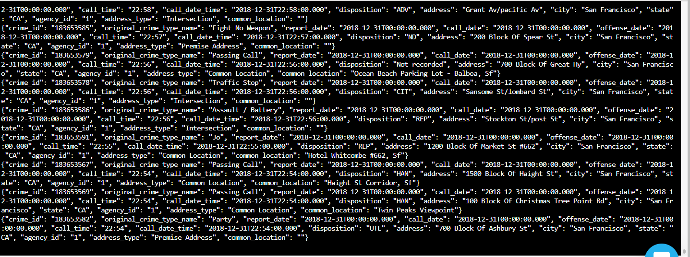
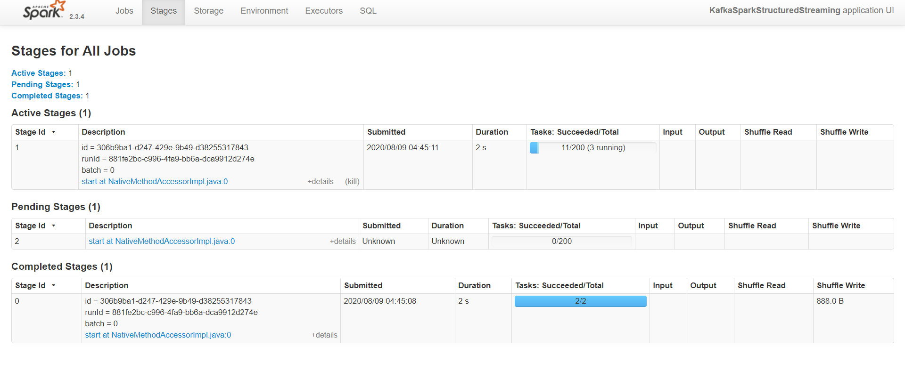
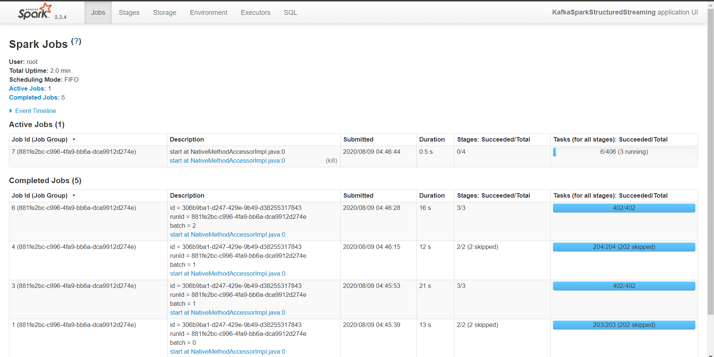

# SF-Crime-Data-Project-Files
Data streaming final project from udacity 

Check if data is produced with kafka-console-consumer
 
   Output looks like this:
   
   
   
Spark UI while executing looks like this:
   
    

Answers to Udacity's Questions :

1. How did changing values on the SparkSession property parameters affect the throughput and latency of the data?

    spark.executor.memory : setting executor memory 
    spark.executor.cores : setting executor cores
    spark.driver.memory : setting driver memory
    numInputRecords : The number of records processed in a trigger
    inputRowsPerSecond : The rate of data arriving
    processedRowsPerSecond : The rate at which Spark is processing data
    

2. What were the 2-3 most efficient SparkSession property key/value pairs? Through testing multiple variations on values, how can you tell these were the most optimal? 

    spark.default.parallelism : 3
    spark.streaming.kafka.maxRatePerPartition : 10
